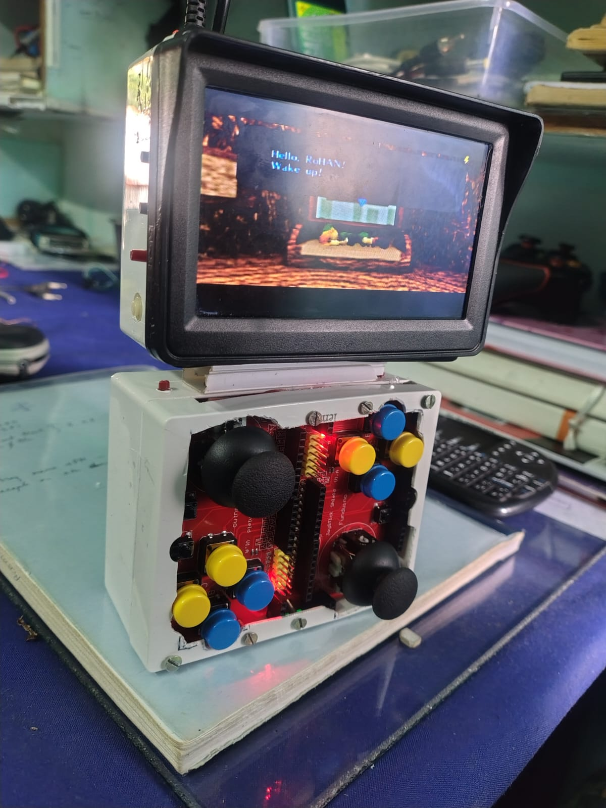

# 🕹️ DIY RetroPie Handheld Console with Custom Bluetooth Gamepad

A modular, portable RetroPie-powered console with a custom-built Bluetooth gamepad using ESP32 and Arduino joystick shields. Built from scratch using commonly available components for a nostalgic and fun retro gaming experience.

---

## 🎮 Features

- **Raspberry Pi** running RetroPie OS
- **5-inch composite car display** in a custom case (connected via 3.5mm headphone jack for video)
- **4x 18650 Li-ion batteries** with **2S 20A BMS**
- **XL4015 buck converter** for powering Pi and cooling fan
- **PAM8403 amplifier** with onboard speaker
- **Bluetooth controller** using:
  - 2 Arduino joystick shields
  - 2 tactile shoulder buttons
  - ESP32 with **BleGamepad** library
  - Separate 3.7V Li-ion battery + TP4056 charger
  - LED indicator for Bluetooth status

---

## 📷 Project Images

| CONNECTED | DETACHED  |
|---------|---------|
|  |  |

| RASPBERRY PI 3B | ON TABLE |
|---------|---------|
|  |  |

| GAMPEPAD INTERNALS | CONSOLE INTERNALS |
|---------|---------|
|  |  |

| BOTTOM VIEW 1 | BACK VIEW 2 |
|---------|---------|
|  |  |

Sliding Mechanism 
FOR CONNECTION BETWEEN CONSOLE AND GAMEPAD MADE from TV cable covers

---

## 🧠 Why I Built It

I wanted a modular, retro-inspired handheld console that uses a CRT-style screen and my own custom Bluetooth controller. It’s fully DIY, built from spare parts and designed for retro gaming fun.

---BT gamepad ino file is given dualpad2.ino 
